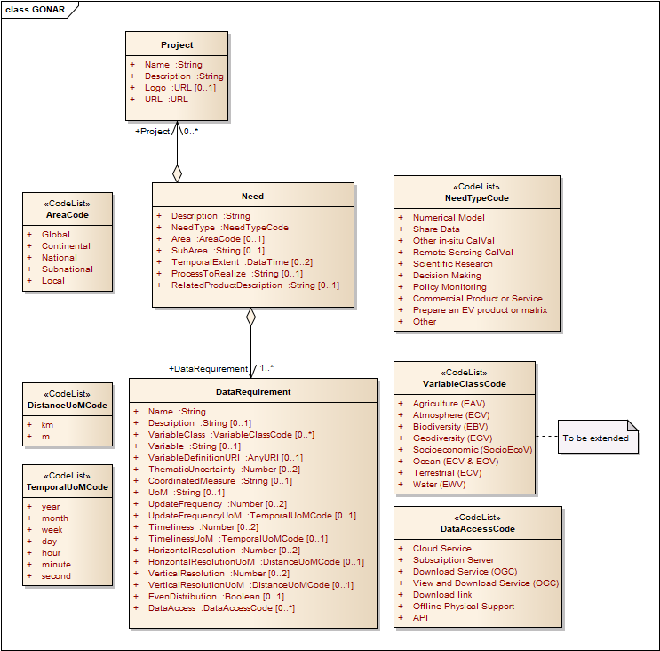
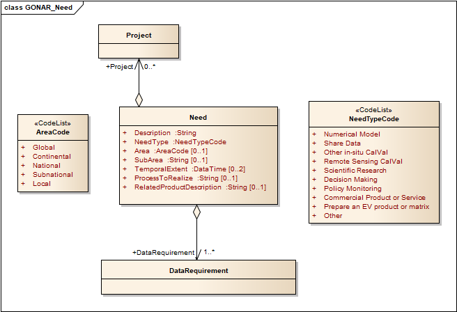
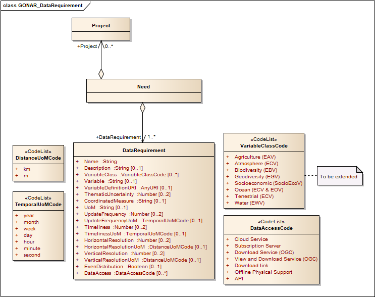
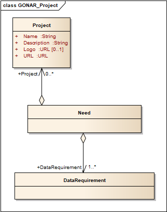

[[sc_need]]
== Requirements Class "Data Model"

=== Overview

The Data Model requirements class defines the data model classes that define a need, a requirement, a project and the relation among them. 

include::../requirements/requirements_class_data_model.adoc[]

[#img_gonar_full,reftext='{figure-caption} {counter:figure-num}']
.GONAR in UML

=== Need

include::../requirements/data-model/need.adoc[]

[#img_need,reftext='{figure-caption} {counter:figure-num}']
.GONAR Need in UML
//image::../figures/FeedbackItem_1.png[width=600,align="center"]

[#tbl_need,reftext='{table-caption} {counter:table-num}']
.GONAR_Need data type
[width = "100%",options="header"]
|===
|*Name* | *Definition*	| *Data type and values* | *Multiplicity and use*
|itemIdentifier | Identifier for the need item. | MD_Identifier data type (ISO 19115-1:2014 B.3.3.3) |  One (mandatory)
|description | Brief narrative description of the need, normally for display to a human. | Character String type, not empty |  Zero or one (optional)
|needType | Needs for data, classified in several types.|  GONAR_NeedTypeCode (see <<tbl_need_type_code>>) | One (mandatory)
|area | Geographic scope or scale of the need.| GONAR_AreaCode (see <<tbl_area_code>>) |  One (mandatory)
|subArea | Name of the specific geographic area, region, locality, or any topographical feature related to the need item.  | Character String type, not empty |  Zero or one (optional)
|temporalExtent | Time period to be covered by the data (in years). | Data time (YYYY-YYYY) |  One or more (mandatory)
|processToRealize | Summary of the methods or tasks that are necessary to realize the need. | Character String type, not empty |  Zero or one (optional)
|relatedProduct | Product to be created or outcome to be achieved as a result of the process. | Character String type, not empty|  Zero or one (optional)
|===

[#tbl_need_type_code,reftext='{table-caption} {counter:table-num}']
.GONAR_NeedTypeCode code list
[cols="20,40",options="header"]
|===
|Property |Description
|Numerical Model | Input or assessment of a numerical model
|Share Data | Deployment of a sharing data system or service
|Other in-situ CalVal | Calibration and validation of other in-situ data
|Remote Sensing CalVal | Calibration and validation of Remote Sensing products
|Scientific Research | Demonstration of a scientific hypothesis or answer a research question
|Decision Making | Assist in a decision-making process
|Policy Monitoring | Calculate a policy monitoring indicator or KPI
|Commercial Product or Service | Provision of a commercial service derived from the data
|Prepare an EV product or matrix | Preparation of a harmonized Essential Variable product or matrix
|Other | Any other need (only if the predefined types do not fit)
|===

[#tbl_area_code,reftext='{table-caption} {counter:table-num}']
.GONAR_AreaCode code list
[cols="20,40",options="header"]
|===
|Property |Description
|Global | Applicable globally, to the whole Earth planet
|Continental | Applicable to a given continent
|National | Applicable to a given country
|Subnational | Applicable to a given region within a country
|Local | Applicable locally
|===

=== Data requirement

include::../requirements/data-model/data-requirement.adoc[]

[#img_data_requirement,reftext='{figure-caption} {counter:figure-num}']
.GONAR Data Requirement in UML

  
   

[#tbl_data_requirement,reftext='{table-caption} {counter:table-num}']
.GONAR_DataRequirement data type
[width = "100%",options="header"]
|===
|*Name* | *Definition*	| *Data type and values* | *Multiplicity and use*
|itemIdentifier | Identifier for the data requirement tiem. | MD_Identifier data type (ISO 19115-1:2014 B.3.3.3) |  One (mandatory)
|description | Brief narrative description of the data requirement, normally for display to a human. | Character String type, not empty |  Zero or one (optional)
|variableClass | Set of Essential Variables (EV)^a^ related to the theme of the data required.|  GONAR_VariableClassCode (see <<tbl_variable_class_code>>) | One (mandatory)
|variable | Name of the variable to be measured.|  Character String type, not empty |  One (mandatory)
|variableDefinitionURI | URI of a definition of the variable.|  Character String type, not empty |  Zero or one (optional)
|thematicUncertainty | Level of thematic uncertainty or error that can be accepted to address the need, expressed in standard units of measurement.|  Number |  Zero or one (optional)
|coordinateMeasure | Other variables that should be captured in the same location in a coordinated manner together with the main variable required.|  Character String type, not empty |  Zero or one (optional)
|updateFrequency | Time interval or how often the data must be captured.|  Number |  Zero or one (optional)
|updateFrequencyUoM | Units of measurement of time.|  GONAR_TemporalUoMCode (see <<tbl_temporal_uom_code>>) |  Zero or one (optional)
|timeliness | Time delay between the measurement acquisition and results accessibility required to address the need.|  Number |  Zero or one (optional)
|timelinessUoM | Units of measurement of time.|  GONAR_TemporalUoMCode (see <<tbl_temporal_uom_code>>) |  Zero or one (optional)
|horizontalResolution | Minimum distance in the horizontal dimension that should separate two close measurements.|  Number |  Zero or one (optional)
|horizontalResolutionUoM | Units of measurement of distance.|  GONAR_DistanceUoMCode (see <<tbl_distance_uom_code>>) |  Zero or one (optional)
|verticalResolution | Minimum distance in the vertical dimension that should separate two close measurements.|  Number |  Zero or one (optional)
|verticalResolutionUoM | Units of measurement of distance.|  GONAR_DistanceUoMCode (see <<tbl_distance_uom_code>>) |  Zero or one (optional)
|evenDistribution | How uniform the distribution of the samples would be. | Boolean |  Zero or one (optional)
|dataAccess | Expected method to access to the required data. | GONAR_DataAccessCode (see <<tbl_data_access_code>>) |  One or more (optional)
|citSciAcceptance | Whether citizen science data is accepted (yes or not) and why. | Character String type, not empty |  Zero or one (optional)
4+| ^a^ GONAR proposes to use the Essential Variables framework defined by Lehmann et al in 2020 (DOI 10.1080/17538947.2019.1636490) to classify the requirements thematically. Thus, each required variable to be observed must be associated to their respective class.
|===

[#tbl_variable_class_code,reftext='{table-caption} {counter:table-num}']
.GONAR_VariableClassCode code list
[cols="20,40",options="header"]
|===
|Property |Description
|Agriculture (EAV) | Essential Agriculture Variables
|Atmosphere (ECV) | Essential Climate Variables - Atmosphere
|Biodiversity (EBV) | Essential Biodiversity Variables
|Geodiversity (EGV) | Essential Geodiversity Variables
|Socioeconomic (SocioEcoV) | Socioeconomic Variables
|Ocean (ECV & EOV) | Essential Climate Variables - Ocean
|Terrestrial (ECV) | Essential Climate Variables - Terrestrial
|Water (EWV) | Essential Water Variables
|===

[#tbl_temporal_uom_code,reftext='{table-caption} {counter:table-num}']
.GONAR_TemporalUoMCode code list
[cols="20,40",options="header"]
|===
|Property |Description
|year | Calendar year
|month | Calendar month
|week | Calendar week
|day | Calendar day
|hour | Time interval of 60 minutes
|minute | Time interval of 60 seconds
|second | Base unit of time
|===

[#tbl_distance_uom_code,reftext='{table-caption} {counter:table-num}']
.GONAR_DistanceUoMCode code list
[cols="20,40",options="header"]
|===
|Property |Description
|km | Kilometer
|m | Meter
|===

[#tbl_data_access_code,reftext='{table-caption} {counter:table-num}']
.GONAR_DataAccessCode code list
[cols="20,40",options="header"]
|===
|Property |Description
|Cloud Service | Data access service on the Internet.
|Subscription Server | Data access is allowed only to registered users.
|Download Service (OGC) | OGC compliant service that supports data download.
|View and Download Service (OGC) | OGC compliant service that supports both data visualization and data download.
|Download link | Direct web address (URL) to a downloadable file or dataset.
|Offline Physical Support | Data provided on a tangible format (e.g., DVD, USB, analogic data).
|API | Application Programming Interface.
|===

=== Project

include::../requirements/data-model/project.adoc[]

[#img_project,reftext='{figure-caption} {counter:figure-num}']
.GONAR Project in UML
//image::../figures/FeedbackItem_1.png[width=600,align="center"]

[#tbl_project,reftext='{table-caption} {counter:table-num}']
.GONAR_Project data type
[width = "100%",options="header"]
|===
|*Name* | *Definition*	| *Data type and values* | *Multiplicity and use*
|itemIdentifier | Identifier for the project item. | MD_Identifier data type (ISO 19115-1:2014 B.3.3.3) |  One (mandatory)
|name | Name of the project. | Character String type, not empty |  One (mandatory)
|description | Brief narrative description of the project, normally for display to a human. | Character String type, not empty |  One (mandatory)
|logo | URL of the project logo. | Character String type, not empty |  Zero or one (optional)
|URL | Project URL. | Character String type, not empty |  One (mandatory)
|===

	

